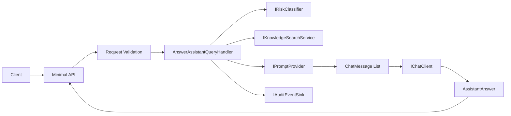

# Phase A Overview

Phase A proves the request path with deterministic mock infrastructure. The API validates the request, dispatches to the Application handler, and maps the response without retrieval or generation logic in the host.

Phase B replaces `MockKnowledgeSearchService` with an Azure AI Search adapter in Infrastructure and changes DI composition only. Phase C replaces `MockChatClient` with an Azure OpenAI-backed `IChatClient` registration, while the handler continues to consume the same vendor-neutral abstraction.
