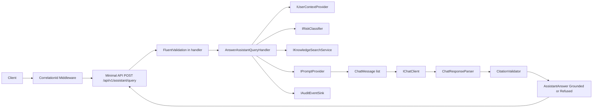
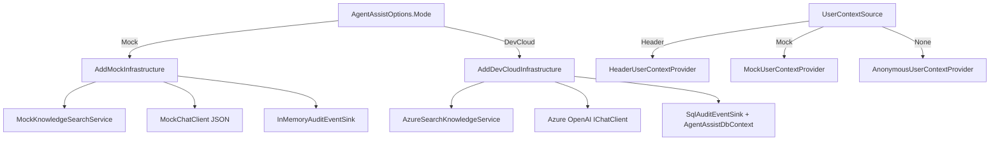
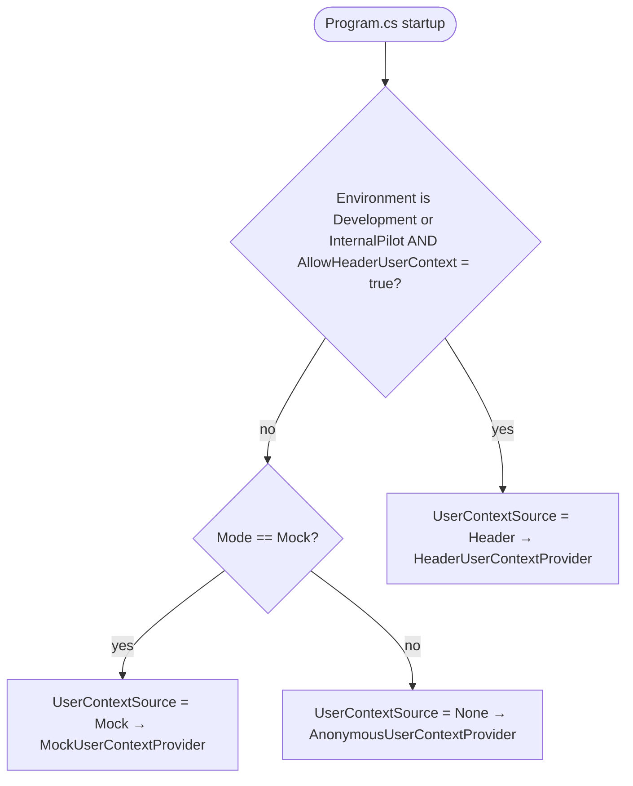

# Production Pilot Architecture Overview (Internal Pilot / Reference Architecture)

The production pilot keeps the Phase A request path and swaps in Azure-backed adapters behind the same Application abstractions. Mock mode and DevCloud mode are both supported and selected by `AgentAssistOptions.Mode`.

## Logical Flow

## Composition

`Program.cs` selects one of two infrastructure compositions based on `AgentAssistOptions.Mode`, and an orthogonal `UserContextSource` (Mock / Header / None) that decides which `IUserContextProvider` is registered:

## Pilot User Context Flow

`Program.cs` resolves `UserContextSource` deterministically from the host environment and `AgentAssistOptions.AllowHeaderUserContext`:

Per-request path when `Header` is selected:

```mermaid
flowchart LR
    request[HTTP request]
    headers[X-Agent-User / X-Agent-Roles / X-Agent-Location]
    request --> headers
    headers --> provider[HeaderUserContextProvider]
    provider --> validate[Validate length + allow-list]
    validate --> ctx[IUserContextProvider]
    ctx --> handler[AnswerAssistantQueryHandler]
    handler --> filter[AzureSearchFilterBuilder]
    filter --> search[Azure AI Search query]
```

Notes:

- `UserContextSource.Header` is selected only when the host environment is `Development` or `InternalPilot` **and** `AgentAssistOptions.AllowHeaderUserContext` is `true`. `AgentAssistOptionsValidator` fails startup if `AllowHeaderUserContext` is `true` in `Production` (see ADR-0010).
- `UserContextSource.Mock` is selected when the previous condition is false **and** `AgentAssistOptions.Mode == Mock` (deterministic in-memory context for offline runs and tests).
- `UserContextSource.None` is the production-like fallback. `AnonymousUserContextProvider` returns `UserId = null`, `Roles = ["anon"]`, `Location = null`, so `AzureSearchFilterBuilder` collapses every retrieval call to zero hits (deny-by-default). A startup `LogWarning` is emitted whenever the active source is not `Header` to remind operators that an authentication-backed provider must be wired in before exposing the deployment to untrusted networks.
- The request body is a strict DTO: `userId` / `roles` / `location` fields are rejected with HTTP 400 + a `ProblemDetails` "authentication-context" message; identity flows exclusively from `IUserContextProvider`.

## Citation-First Invariants

- `AssistantAnswer.Grounded(...)` rejects empty citation lists with `UngroundedAnswerException`.
- `AnswerAssistantQueryHandler.HandleAsync` calls `EnsureCitationInvariant()` after `Grounded(...)` for defence in depth.
- The structured citation pipeline (`ChatResponseParser` + `CitationValidator`) is the only grounding proof; text marker matches such as `[1]` are not accepted.
- Malformed JSON, unknown citation IDs, and empty citation lists on a non-refused answer all collapse to a structured refusal.

## Boundary Rules (enforced by `AgentAssist.Architecture.Tests`)

- Domain references no third-party assembly.
- Application references no `Azure.*`, `Microsoft.EntityFrameworkCore`, or `Microsoft.AspNetCore.*` assembly.
- Infrastructure is the only project that pulls in Azure SDKs and EF Core.
- No `ControllerBase` types anywhere in the solution.
